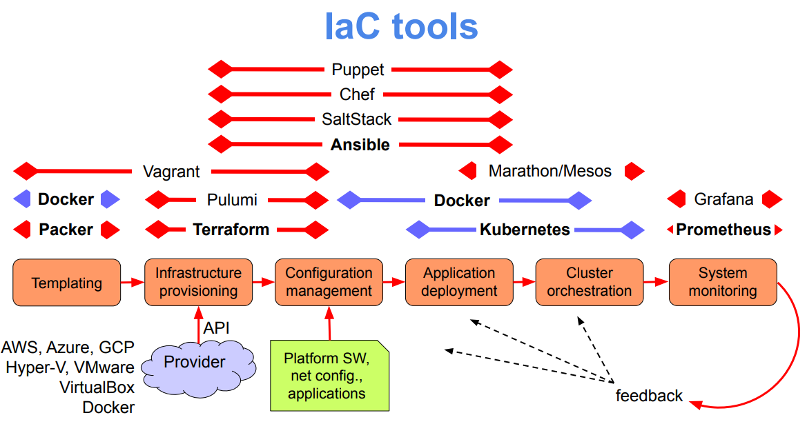

# Notes (Add later)

- **Vagrant:** Vagrant is a tool to automatically deploy and manage virtual machines (using VirtualBox, KVM, Docker containers, etc.); its objective is to give system admins the capability of automatically create, deploy and manage virtual machines, without having to rely in inefficient GUIs to deploy virtual machines.
- **Ansible:** Ansible works by establshing connection (SSH) to infrastrucutre nodes, and then executes programs on these nodes, called **Ansible Modules**. Ansible is therefore used to manage nodes (can be VMs, containers, physical machines, etc.) so that you can run the desired programs in such machines.

## Difference between Vagrant and Ansible

|Vagrant     | Ansible      |
|------------|--------------|
|Used for **deploying** nodes (virtual machines, containers, etc.)| Used for **managing** programs running inside nodes|

