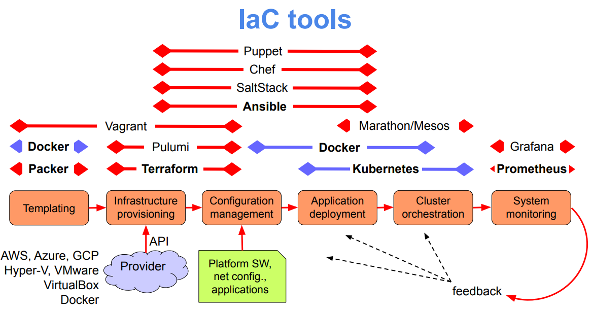

# Notes (Add later)

- **Vagrant:** Vagrant is a tool to automatically deploy and manage virtual machines (using VirtualBox, KVM, Docker containers, etc.); its objective is to give system admins the capability of automatically create, deploy and manage virtual machines, without having to rely in inefficient GUIs to deploy virtual machines.
- **Ansible:** Ansible works by establshing connection (SSH) to infrastrucutre nodes, and then executes programs on these nodes, called **Ansible Modules**. Ansible is therefore used to manage nodes (can be VMs, containers, physical machines, etc.) so that you can run the desired programs in such machines.

## Difference between Vagrant and Ansible

|Vagrant     | Ansible      |
|------------|--------------|
|Used for **deploying** nodes (virtual machines, containers, etc.)| Used for **managing** programs running inside nodes|

## Docker Swarm, Docker Services and Clusters

- **Docker Swarm:** Docker Swarm is a cluster orchestration tool, provided by Docker, that serves to manage **services** across different machines. In Docker Swarm, there is always a machine that is the **master**, which controls and orchestrates the **worker** machines, which are the ones actually host the containers. Docker Swarm is an alternative to popular orchestration tool **Kubernetes**.

- **Docker Service:** A Docker Service is a higher-level abstraction, which can be managed by Docker Swarm. It encompasses several containers that are performing the same task; a service is usually a part of a multi-service application.

- **Cluster:** A cluster is essentially a set of machines, that communicate with eachother to ensure proper functioning in order to **act as a single machine would**. This means that a cluster can emulate a service/program that could run in a single machine, but with the **benefits of using several machine** (higher reliability, redundancy, throughput, lower latency, etc.). Relative to the concetps above, **Docker Swarm** creates and manages a **cluster** of machines, which are running several **Docker Services** (which could otherwise be ran in a single machine).