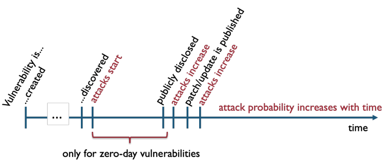
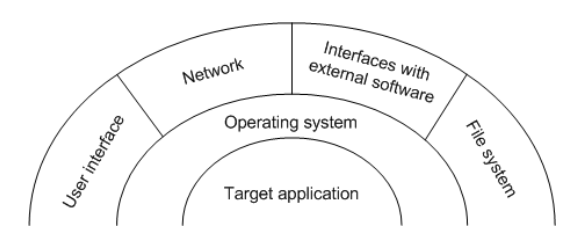

---
tags:
  - cybersecurity
author: Simão Silva
sidebar_position: 1
toc_min_heading_level: 2
toc_max_heading_level: 3
---
---
In this note, we will explain some basic concepts in software security that are important for more advanced topics in Cybersecurity. Some of these concepts are:

- [Security Attributes](#security-attributes-(cia))
- [Vulnerabilities](#Vulnerabilities)
- [Attacks](#attacks)
- [Attack Types](#attack-types)

---
## Security Attributes (CIA)

Security attributes are the **properties** we want to enforce in a system, so that we can deem it **secure** for all its users. There are **three** security attributes:

- **Confidentiality:** the non-disclosure of information to non-authorized parties
- **Integrity:** prevents the illegal modification of data by non-authorized parties
- **Availability:** the readiness of a system to provide its service to its clients

It is important to note that, for confidentiality and integrity, we mention **non-authorized parties**. For the definition of authorized/non-authorized parties for certain pieces of information, we will need to define a **security policy**.

## Vulnerabilities

>**Vulnerability:** A defect in a system that allows an attacker to exploit it and break a security policy

There are many known vulnerabilities and types of vulnerabilities; their identification and understanding is **vital** for software security, and it is one of the main points of study by security specialists.

> **0-day vulnerability:** A vulnerability that is not known by the people that might mitigate it (developers, security specialists), but known by another group of people (that might be attackers).

  **Fig.1:** Vulnerability's lifecycle 

### Vulnerability Types

There are three types of vulnerabilities in which vulnerabilities can be characterised:

- **Design Vulnerability:** Vulnerability originated in the software design (bad/careless design)
- **Coding Vulnerability:** Vulnerability introduced in the programming of the system
- **Operational Vulnerability:** Vulnerability related to the environment where the system is running

## Attacks

We have now covered the topic of [vulnerabilities](#Vulnerabilities) and how important their understanding is for security. However, vulnerabilities by themselves are **harmless**; a vulnerability is only harmful if there is an **attack**.

> **Attack:** Actions conducted by attacker/attackers, that exploit a vulnerability to break security policies

> **Attack + Vulnerability -> Intrusion**

> **Exploit:** Piece of code that activates a vulnerability

### Attack Surface

The attack surface is simply the interface an attacker uses to conduct its attack. This is a diagram of the possible attack surfaces:

  **Fig.2:** Attack surfaces

### Attack Types

Now that we have introduced several important concepts and definitions, we will now look into a more general view of the several types of attack that exist.

Before we do this, it is important to look at the concept of **attack vector**, which the **path** that attackers take to conduct an attack. Attack vectors can cover a lot of different topics (vulnerability explored, type of attack, manual or automated, etc.).

#### Manual Attacks

Manual attacks, conducted by attackers, have several steps to their execution:

1. **Footprinting**
	- Initial gathering of information about target system, like IP adresses, protocols, systems that are connected to the internet
	- One can get this information through DNS, databases, [WHOIS](https://who.is/)
2. **Scanning**
	- Now that initial information has been gathered, we can get further information to look for reachable systems (conduct actions like **port scanning**)
	- **Fingerprinting:** gathering information about what software is used by target, and its versions ^df7a7f
3. **Enumeration**
	- Further gathering of information, now more intrusive, like network resources, users/groups, permissions
4. **Discover Vulnerabilities**
	- With all information gathered, we can check for vulnerabilities, either manually, or by using tools like Nessus, OpenVAS, Havij for SQLi
5. **Attack**
	- Running the exploit (**intrusion**)
6. **Privilege escalation**
	- Using other vulnerabilities to gain unauthorised access to system
7. **Installing rootkit/backdoor**
8. **Cover tracks**

#### Automated Attacks

We will now look into several automated attacks.

##### Worm

A [worm](https://en.wikipedia.org/wiki/Computer_worm) is a type of malware that can replicate itself and infect other computers (typically through the Internet) without the help of human action. The components of a worm are:

- **Target Selector**
- **Scanning Motor**
	- The previous are the equivalent to **footprinting**, **scanning** and **enumeration** [seen above](#manual-attacks)
- **Warhead**
	- Exploit Code
- **Load**
	- The bot/rootkit carried by the worm
- **Propagation Motor**
	- Moves the worm

###### Drive-by Download

[Drive-by download](https://www.kaspersky.com/resource-center/definitions/drive-by-download) is a type of **worm** in which an attacker injects malicious code in a **vulnerable webpage**; when the victim visits that webpage using a **vulnerable browser**, the victim's computer will download malware, without the user realizing it.

   
**Fig.3:** Drive-by Download Attack

###### Watering Hole Attack

[Particular type](https://www.techtarget.com/searchsecurity/definition/watering-hole-attack) of **drive-by download** attack:

   
**Fig.4:** Watering Hole Attack

##### Virus

[Viruses](https://en.wikipedia.org/wiki/Computer_virus) are very similar to worms, but the main difference is that **viruses cannot self-replicate**, and require **physical contact** (i.e. inserting infected usb drive, disk, mp3 player, etc.) to replicate. Some type of attacks using viruses are:

- **Thumb drive attack:** Leave an infected usb drive in a public place; hope that someone will take it and insert it in their computer (triggering the replication/attack)
- **BYOD (Bring Your Own Device):** policy adopted by companies that allows employees to use their personal devices; the problem is that these devices **can be infected**

##### Trojan Horse

[Trojan horses](https://en.wikipedia.org/wiki/Trojan_horse_(computing)) are very similar to viruses, but they require the user to **run** an infected program; the malware is **disguised** as a **legitimate program** (thus the name Trojan horse). One of the most common ways to propagate Trojans is by sending **emails** with **attachments** that are Trojans.

##### Backdoor

A [backdoor](https://pt.wikipedia.org/wiki/Backdoor) is a method used by an attacker to get **unauthorized access** to a system. A backdoor can be **installed** by an attacker in an initial intrusion, to then be used later by the attacker.

##### Rootkit

A [rootkit](https://en.wikipedia.org/wiki/Rootkit) is a program that is designed to enable unauthorized access to computer resources, perform actions that are illegal to a certain user and the **disguise its activity** (for example, replace _ls_ command in Linux to not show malware file).

##### Bot or Remote Access Trojan (RAT)

A bot, or remote access Trojan, is software that listens in a certain port, waiting to be contacted by a **Command & Control server** (C&C) to do something, like:

- Extruding information
- Invade other machine in an organization
- Send spam, rogueware announces or perform **DDOS** attacks

##### Ransomware

Malware that **encrypts** user data, with a key that only attacker knows. Attacker then asks for **monetary compensation** to give the key and **decrypt** the data.

##### Cryptojacking

Malware that **mines** cryptocurrency, consuming electricity and computer resources.

##### Scareware and Rogueware

**[Scareware](https://en.wikipedia.org/wiki/Scareware)** is scamming users into convincing them there is a problem with their computer (e.g., virus) and leading them into installing **useless/malicious** programs. **[Rogueware](https://en.wikipedia.org/wiki/Rogue_security_software)** is that software (e.g., fake antivirus).

##### Phishing and Spear Phishing

**Phishing** attacks typically envolve **social engineering**; they consist into sending **fake emails**, usually to lead users to provide **credentials** information (e.g., password to bank account). Despite being very simple, these are one of the most dangerous attacks (security systems cannot prevent/defend these types of attacks; in this case we have to rely on educating to never share passwords).

**Spear Phishing** is simply phishing **targeted** at certain people (e.g., phishing directed at people with high permissions in a company), while **smishing** is the same as phishing, but using **SMS**.

##### Torpig - A sophisticated attack

- Infection of bots with drive-by download:
- Attackers modify legitimate but vulnerable server for some webpages to request JavaScript code from the attacker’s web server
- The victim’s browser accesses the vulnerable server
- JavaScript code exploits the browser/plugins/etc.
- If an exploit is successful, the script downloads and installs the Mebroot rootkit (replaces Master Boot Record) – victim becomes a bot
- Mebroot has no attack capacity:
- Contacts C&C server to obtain malicious modules
- Stores them encrypted in directory system32 and changes the names and timestamps to avoid suspicions
- Every 2h contacts C&C server: sends its configuration (type/version of modules); gets updates; communication is encrypted over HTTP
- For Torpig, the Mebroot modules are Torpig’s – They are injected in legitimate software: service control manager (services.exe), file manager, web browsers, email clients, etc.
- Torpig inspects those programs and steals data – e.g., credentials for online accounts, passwords
- Every 20 minutes contacts C&C to upload stolen data – C&C replies ok or tells bot to do…
- Man-in-the-browser phishing attack:
- When victim visits domain from a list (e.g., a bank), the bot contacts an injection server
- Injection server returns attack data: URL of trigger page in the legitimate domain (typ. the login page), where to send results, etc.
- When user visits trigger page, Torpig asks injection server for another page (e.g., that asks for credit card number)

## Intelligence-Driven Security

It is very important to gather knowledge about attacks (information in the previous points), so that we can know what are the more critical systems, and how to effectively protect them (what are the more common vulnerabilities?). The current trend in security is **intelligence-driven security**, i.e. security based on **recent intel** about **threats/attacks:**

- Security vendors get intel from monitoring their clients, dark web
- Then sell this information to other customers