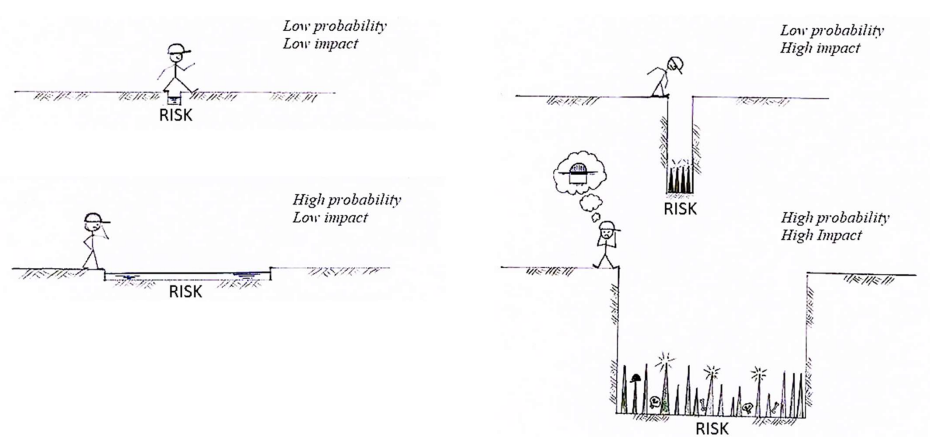

## Motivation for Cybersecurity

- Computers have become part of our daily life
- We are progressively becoming more and more dependent on these tools, and many times we store and share **sensitive information** with others through the **Internet**
- Because the Internet is a shared space, it **cannot be trusted**, and special **security policies** must be enforced by applying the right **security mechanisms** 

## CIA (Confidentiality/Integrity/Availability)

### Confidentiality:

> ___Definition:___ Absence of disclosure of data by non-authorized parties

- Confidentiality ensures that only the right authorized parties have accessed to the information being shared

- **Security Properties:**
	- Privacy
	- Segregation of privileges

### Integrity: 

> ___Definition:___ Absence of invalid data or system modifications by non-authorized parties

- Integrity ensures that the data being secured can only be altered by the authorized parties

- **Security Properties:**
	- Authenticity - Integrity of content and origin
	- Non-repudiation - author of information cannot deny authorship

### Availability:

> ___Definition:___ Readiness of system to provide service

- Availability ensures that a certain system that provides a service to its clients is down the least time possible

## Definitions

> **Vulnerability:** characteristic of a system that makes it susceptible to an attack

> **Attack:** actions that lead to a violation of a security attribute

> **Threat:** Attack that may potentially happen; for this, we need a **vulnerability**, an **actor** and a **motive** (someone with a reason to attack the system)

## Our mission

* The mission of cybersecurity specialists is to create **security policies** and **security mechanisms** to reduce the **risk**

> **Risk:** Combines two parameters: The **probability** that something bad will happen with the **damage** that it will cause if it does happen

> **Security Policy:** A security policy defines, in a shared space and for a given piece of information, who should have access to this information, and who shouldn't, establishing constraints that should be respected

> **Security Mechanism:** A security mechanism is the tool/procedure that is used to **enforce** a certain **security policy**

> __*Example:*__
    - **Security Policy:** All data sent to clients should not be disclosed by potential attackers spoofing the network
    - **Security Mechanism:** Using _TLS/SSL_ to encrypt the communication with the clients