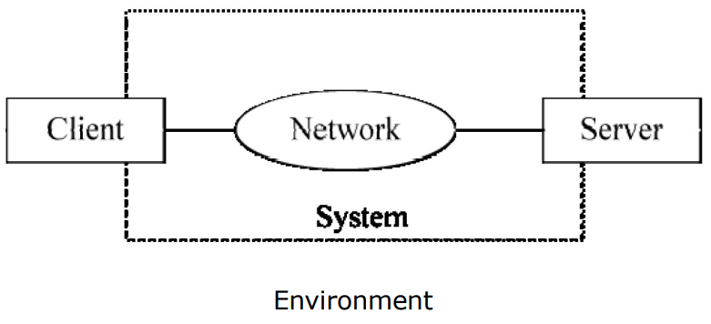
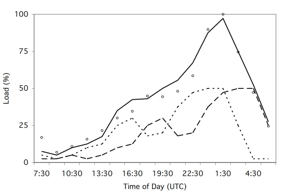

---
tags:
  - computer-networks
  - distributed-systems
  - large-scale-systems
---

# Overview

---
In this note, we will cover what are **large scale systems**, what is the motivation behind them, and how should design and evaluate these systems.

---

In recent years, technology has revolutionized the way businesses and organizations operate, and a need to manage enormous amounts of data and clients has surged as a result of this. To meet these needs, **large scale systems** have emerged as necessary infrastrcuture of today's organizations.

:::tip[Large Scale Systems]
_Large Scale Systems is a term used in fields including Computer Science, Software Engineering and Systems Engineering to refer to software intensive systems with unprecedented amounts of hardware, lines of source code, numbers of users, and volumes of data._ [Source](https://en.wikipedia.org/wiki/Ultra-large-scale_systems)
:::

## Motivation

We can pin point **three main motivators** for large scale systems:

- **Too many clients:** Nowadays, global organizations can serve millions, if not billions of clients, sometimes spread all around the globe
- **Too much data:** With this amount of clients, an extensive quantity of data (Big Data) will need to be stored and managed
- **Request Complexity:** Web requests have also become more complex; a "simple" Google web search touches 50+ services across 1000s of machines

## Design

The design process of a large scale system should be thoroughly planned and executed, because **typically system requirements change and evolve**, when we are developing systems for large organizations. Therefore, analysis on the system requirements should not only take into account what is needed today, but also **what might be the needs in the future.**

So, not only we need to study if the current system works if the scale changes by, let's say, 10x or 20x, but also **what that scale change might potentially be** (for example, it could be 100x). This must happen <u>**before the system is built**.</u>

### Approach

The design process should follow this systematic approach:

1. State goals and define the system
2. Design principles and key limitations
3. Simulate
4. Evaluate
5. Repeat

### System Goals and Definition

In a very simplified view, we can define a system with the following graph:

  
**Fig.1:** Simplified view of a system

As the image shows, a system can be divided into three components:

- Client
- Network
- Server

#### Server

The server component of a system provides **storage** and **computation** to the system. Obviously, in a large scale system, the "server" part is not comprised of a single machine, but of a set of machines, coordinated to perform the job correctly, and many times **distributed globally**. The number of machines may also vary in a short amount of time, to **satisfy the current demand**; as the following image shows, demand can vary a lot in a single day:

  
**Fig.2:** Demand variation thoughout a day

For a system to be able to adapt to the current demand, it is important to introduce the concept of **elasticity**.

:::tip[Elasticity]
_Property of a system that allows it to adapt its resources over time to demand_
:::

**Cloud Computing** formalizes this notion, by providing a pool of resources that can be acquired or released at will. These types of systems are also called **Self Adapting Systems**.

#### Network

The network has many functions, but the main role it plays out in a system is to **connect clients and servers**. These are some of the components of a network:

  
**Fig.3:** Network Components

For a system design, it is important to evaluate the performance of the network (how fast can it go?), so that potential bottlenecks can be identifies; we can increase the server capacity, but if the underlying infrastructure (network) cannot handle any more work, that increase is useless.

