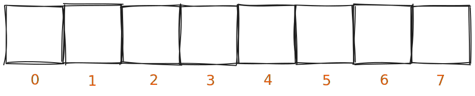
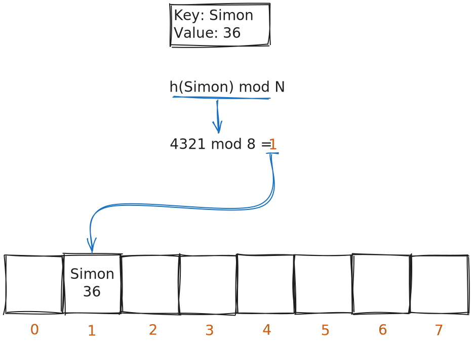
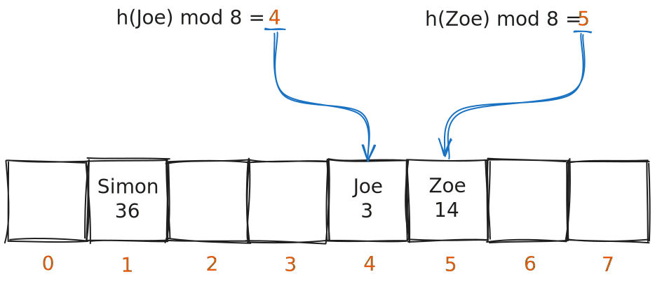
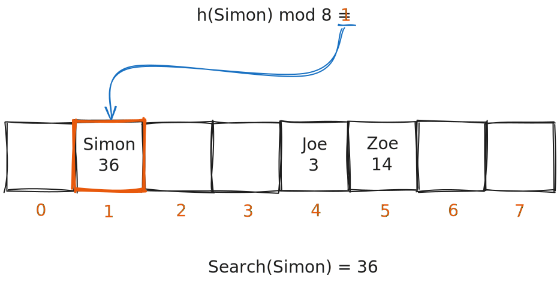
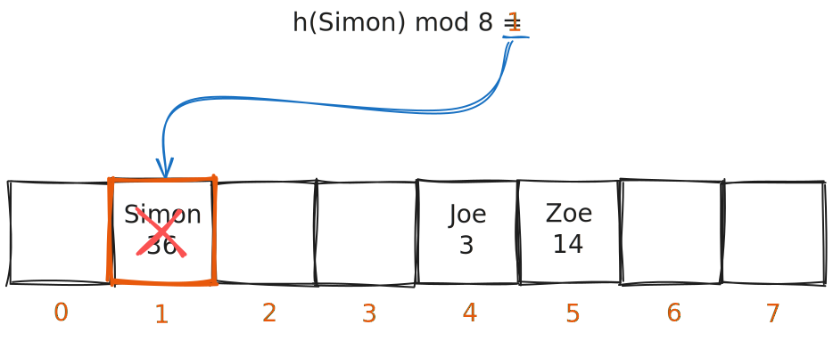

# Hash Table

A hash table is used to store key/value pairs, making use of hash functions. It is characterized by **_O(1)_ search, insertion, and deletion**.

## Functioning

Hash tables are used to store key/value pairs. For this, this data structure makes use of an array of size N. In this example, we will start with N = 8.

Each position of the array is marked from numbers 0 to N, and will be used to store a key/value pair.

### Insertion

Inserting a key/value pair basically consists in deciding which position that given key/value pair belongs to. For this, the hash of the key is computed, using a hash function _h()_. The value returned by this hash function can be represented by a numerical number. The position of the key/value pair is given by **_h(key)_ mod N**.

  
Hash Functions

  There exist several different hash functions, each built for different purposes according to their characteristics; some are designed for cryptography (SHA Family, MD5, etc.), others for passwords (bcrypt, argon2, etc.), among other use cases.
  
  In the case of hash tables, we want to use a simple and fast function. Java's implementation of hash tables/maps uses the built-in function [_hashCode()_](https://docs.oracle.com/javase/7/docs/api/java/lang/Object.html#hashCode()), which returns an integer.

This process is repeated for each key/value pair intended to be inserted.

:::info[Time Complexity]
Insertion is a _O(1)_ operation on average, but can degrade to _O(N)_ in the worst case (when all keys hash to the same index).
:::

### Search

Searching takes as input a given key, and returns the associated value. To find the correct position of the array where the key/value pair should be, the same process used in insertion is used: the provided key is hashed (**_h(key)_**), and then the position is given by **_h(key)_ mod N**.

If there is no value at the position, then it means that the prompted key does not exist in this hash table.

:::info[Time Complexity]
Search is a _O(1)_ operation on average, but can also degrade to _O(N)_ in the worst case (when all keys hash to the same index).
:::

### Deletion

Deletes are also pretty simple, and follow the same reasoning of the other operations: given a key to delete, **_h(key)_ mod N** is computed to get the position of the array, and if there is a value in such position, the key/value pair is removed.

## Collisions

The information aforementioned presented a scenario that does not consider collisions. A collision is when two or more keys map to the same position of the array. There are several techniques for handling collisions, which we will cover:

- **Linear Probing**
- **Chaining**

### Linear Probing